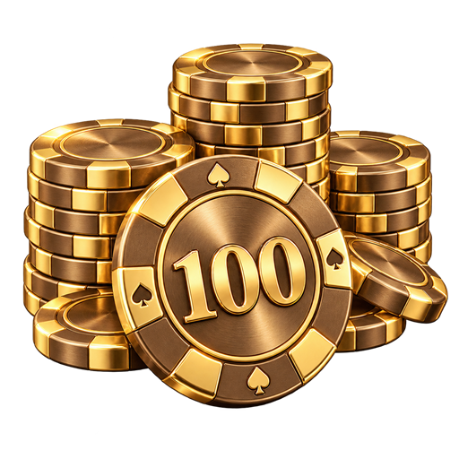
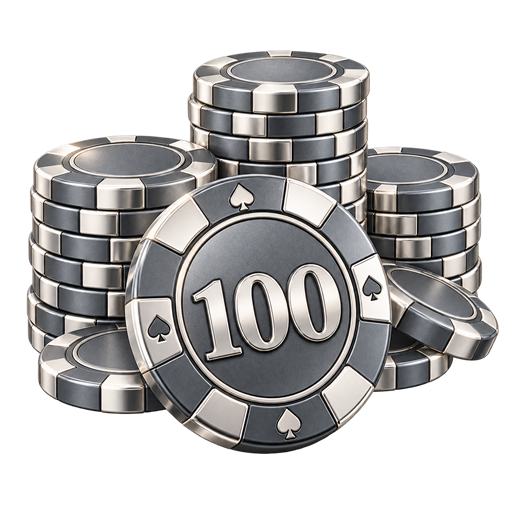
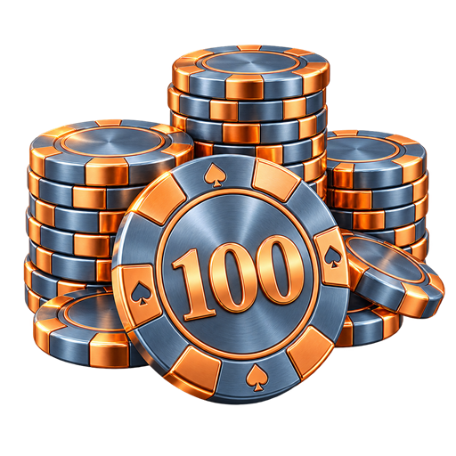
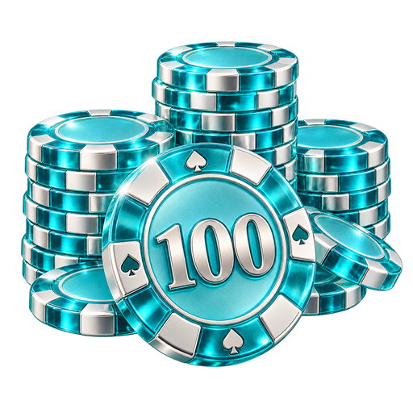
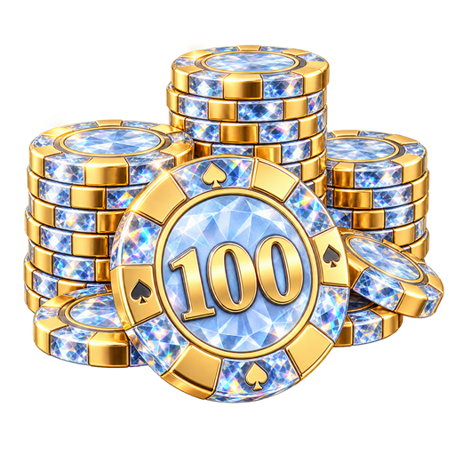
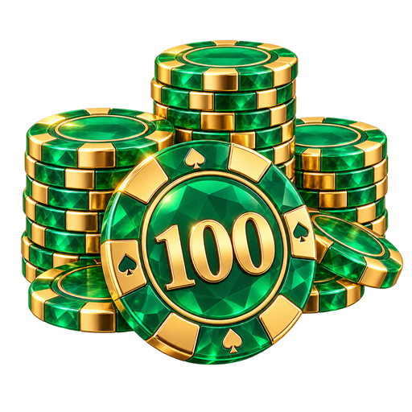
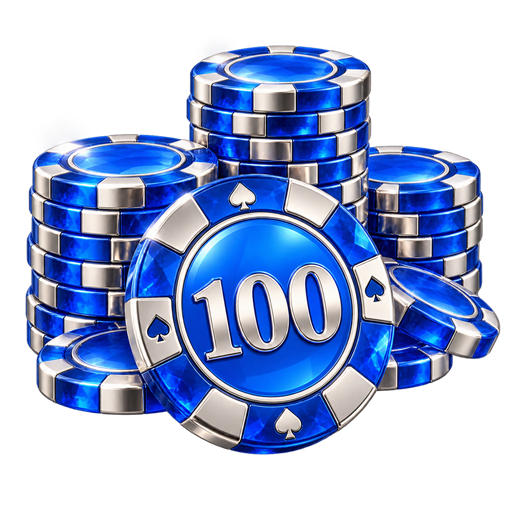
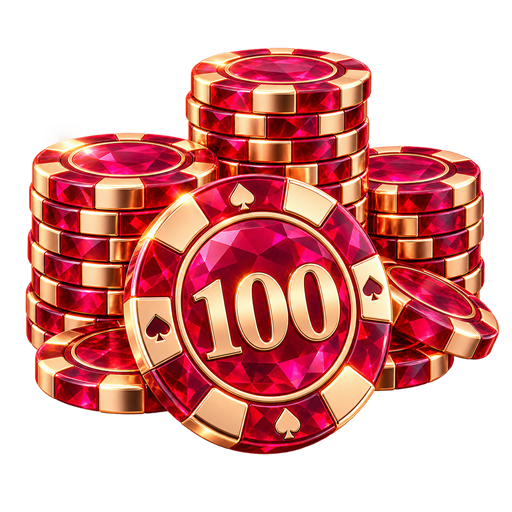
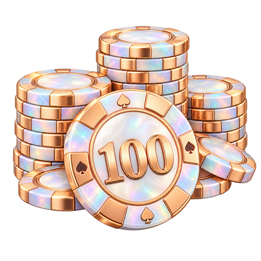
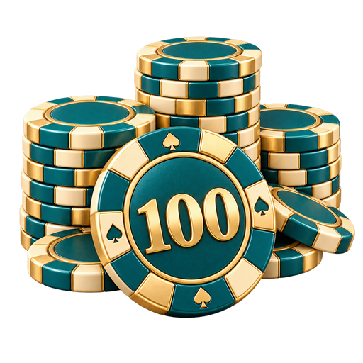

# LEVEL — тестовые изображения

Публичная коллекция тестовых вариантов значков достижений для покерного приложения LEVEL.

## Материалы — серия 01

10 вариантов значка «100 турниров». PNG 512 × 512 с прозрачным фоном. Созданы с помощью ИИ.

| Вариант | Изображение |
| --- | --- |
| 1. Сатиновое золото |  |
| 2. Платина и серебро |  |
| 3. Титан и медь |  |
| 4. Аквамариновое стекло |  |
| 5. Бриллиант и золото |  |
| 6. Изумруд и золото |  |
| 7. Сапфир и платина |  |
| 8. Рубин и розовое золото |  |
| 9. Опал и перламутр |  |
| 10. Белая керамика и эмаль |  |

В папке materials-01 также находится index.html для локального сравнения на светлом и тёмном фоне. Скачайте репозиторий и откройте этот файл в браузере.

Новые тестовые серии добавляются в отдельные папки с сохранением предыдущих вариантов.

## Новые серии — ещё 15 вариантов

- [11–20: белый мрамор и цветное стекло](materials-02/README.md)
- [21–25: варианты по референсу — соты, металл и стеклянные конструкции](reference-03/README.md)

Все изображения: 512 × 512 PNG с прозрачным фоном. В каждой папке есть index.html для локального сравнения на светлом и тёмном фоне.
Всего в репозитории: 25 тестовых изображений.
