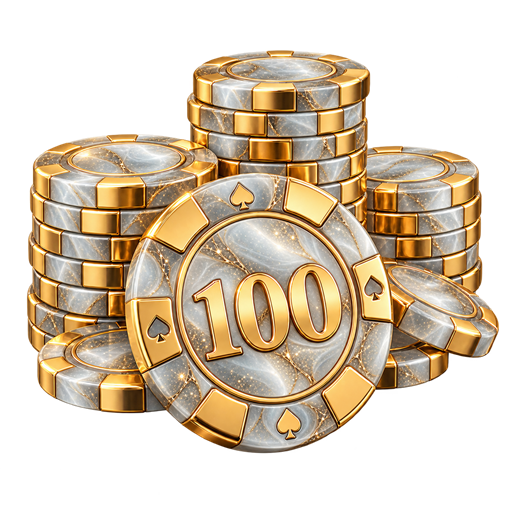
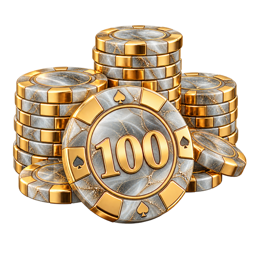
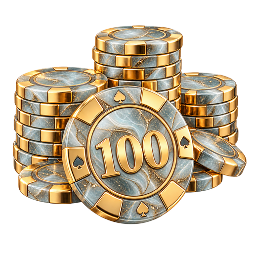

# Перламутровое стекло — варианты 26–30

Круглая форма фишек сохранена; референс используется для материала и рисунка поверхности. PNG 512×512 с прозрачным фоном. Создано встроенным imagegen.

| Вариант | Превью |
| --- | --- |
| 26. Перламутр и золотые линии |  |
| 27. Дымчатое стекло и золото |  |
| 28. Аквамарин и золотые линии |  |
| 29. Лавандовый перламутр |  |
| 30. Молочный опал и золото |  |

