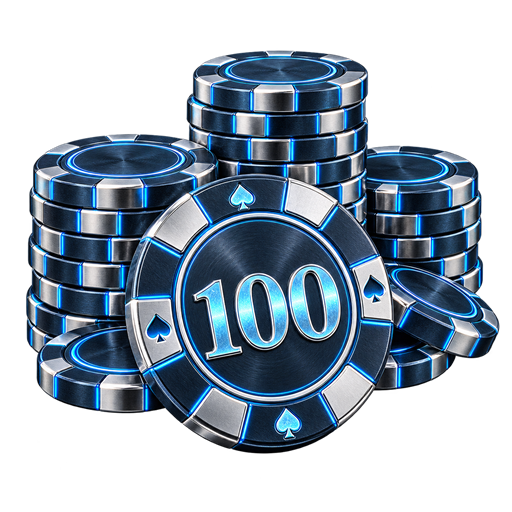
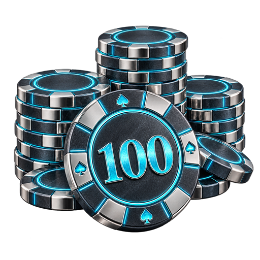
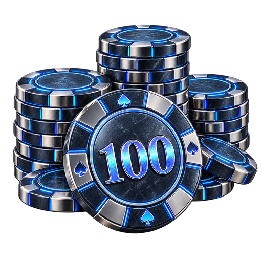

# Тёмный металл со свечением — 32–34

Три варианта по референсу. Круглая форма фишек и композиция сохранены. PNG 512×512, прозрачный фон. Создано встроенным imagegen.

| Вариант | Превью |
| --- | --- |
| 32. Воронёная сталь и голубое свечение |  |
| 33. Титан и бирюзовое свечение |  |
| 34. Чёрный хром и индиго |  |

