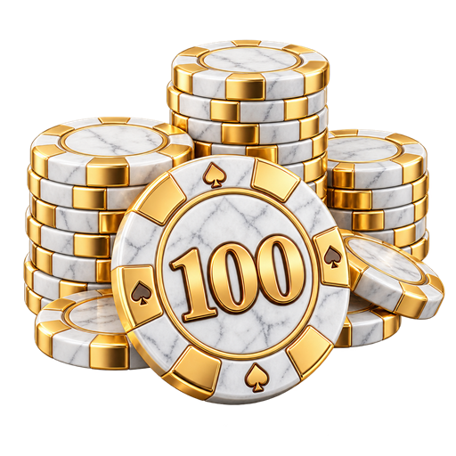
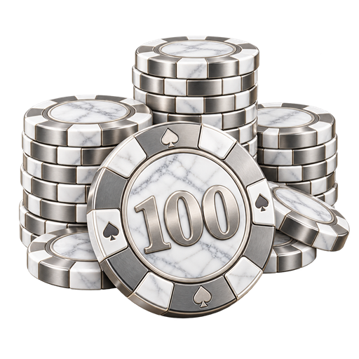
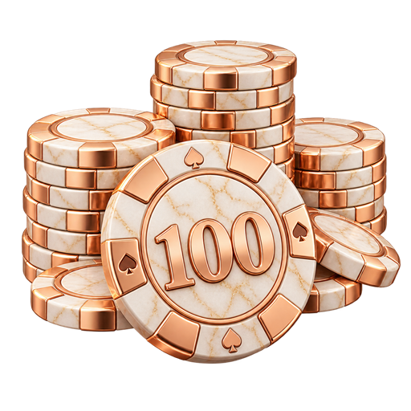
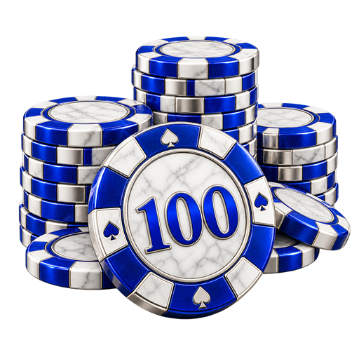
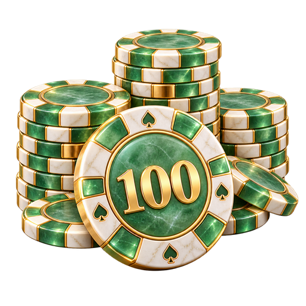
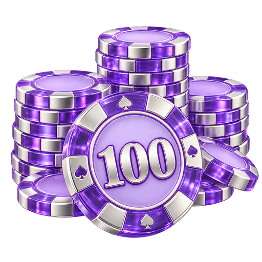
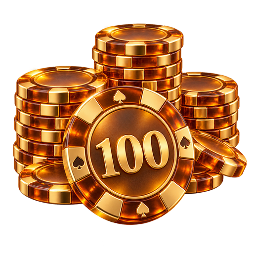
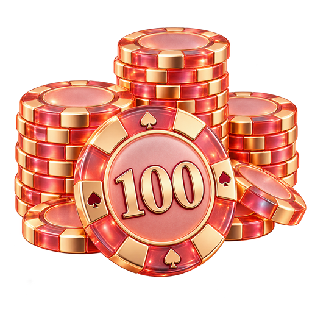
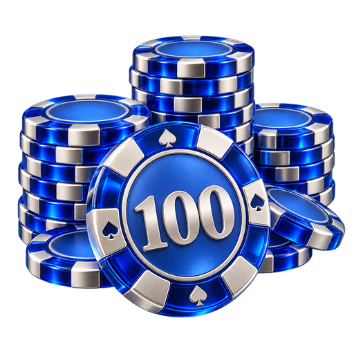
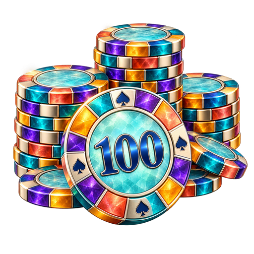

# Белый мрамор и цветное стекло

PNG 512×512, прозрачный фон. Созданы встроенным генератором imagegen.

| Вариант | Превью |
| --- | --- |
| 11. Белый мрамор и золото |  |
| 12. Белый мрамор и платина |  |
| 13. Белый мрамор и розовое золото |  |
| 14. Белый мрамор и кобальт |  |
| 15. Белый мрамор и нефрит |  |
| 16. Лавандовое стекло |  |
| 17. Янтарное стекло |  |
| 18. Коралловое стекло |  |
| 19. Синее стекло |  |
| 20. Цветное витражное стекло |  |

