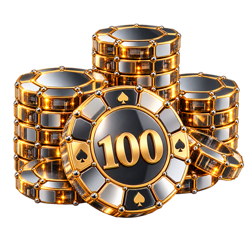
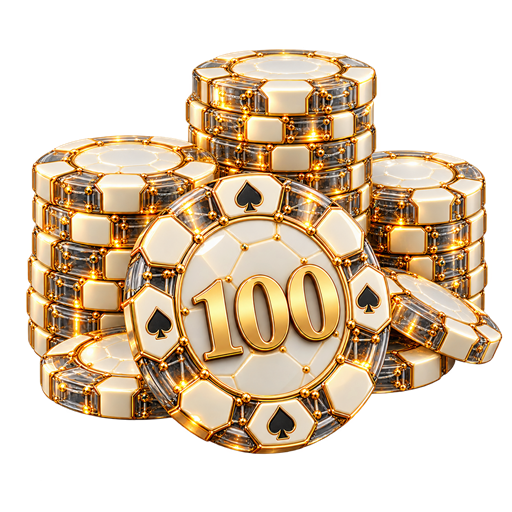
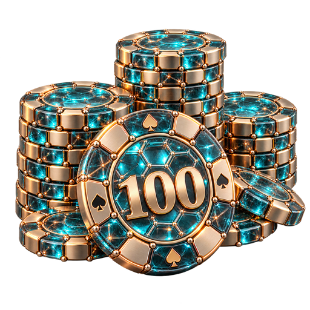
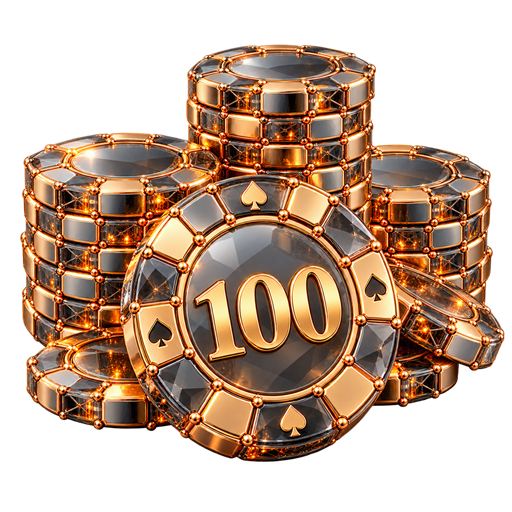
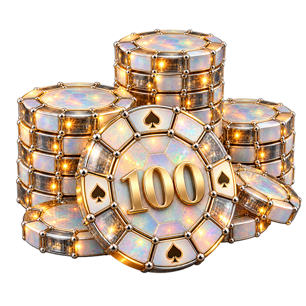

# Варианты по референсу

PNG 512×512, прозрачный фон. Созданы встроенным генератором imagegen.

| Вариант | Превью |
| --- | --- |
| 21. Хромовые соты и золото |  |
| 22. Белые соты и золотой каркас |  |
| 23. Стеклянные соты и титан |  |
| 24. Дымчатое стекло и медь |  |
| 25. Опаловые соты и платина |  |

